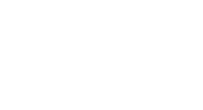

<div align="center">
  
  
  # Aqtasy Robotics - Waabi
  
  ### AI-Powered Robotic Companion for Aphasia Recovery
  
  [](https://reactjs.org/)
  [](https://www.typescriptlang.org/)
  [](https://vitejs.dev/)
  [](https://tailwindcss.com/)

  [Live Demo](https://aqtasyrobotics.com/) 

</div>


## 🎯 About The Project

**Aqtasy Robotics** presents **Waabi** - an intelligent robotic companion designed to bridge the gap between clinical speech therapy and daily recovery for individuals with non-fluent aphasia (Broca's Aphasia). 

Aphasia affects millions worldwide, making communication challenging after stroke or brain injury. Our solution combines cutting-edge AI, embodied robotics, and compassionate design to provide:

- ✨ **Judgment-free repetition** - Essential for neuroplasticity
- 🤖 **Embodied AI interaction** - Physical robot presence increases engagement
- 📊 **Data-driven insights** - Whisper AI analyzes pronunciation accuracy
- 🏠 **24/7 home therapy** - Accessible anytime, anywhere

This repository contains the **marketing website** built with React, showcasing our journey, technology, and mission.

---

## 🚀 Key Features

### 🎨 Modern UI/UX
- **Sci-fi inspired design** with cyberpunk aesthetics
- **Dark theme** optimized for accessibility
- **Smooth animations** using Framer Motion
- **Fully responsive** - Mobile, tablet, and desktop

### 📱 Interactive Sections
- **Hero Section** - Animated orbital rings and floating AI companion
- **About Section** - Educational content about aphasia types
- **Features Showcase** - Highlighting robotic capabilities
- **Tech Stack Display** - Interactive flip cards for hardware/software
- **Team Profiles** - Flip cards with social links
- **Journey Timeline** - Interactive development log with image galleries
- **Pricing Information** - All-in-one package details

### ⚡ Performance Optimized
- **Vite** for lightning-fast development and builds
- **Code splitting** with React Router
- **Lazy loading** for images and components
- **Optimized animations** for 60fps experience

---

## 🛠️ Tech Stack

### Frontend Framework
- **React 19.2.0** - Latest React with improved performance
- **TypeScript 5.8.3** - Type-safe development
- **Vite 6.4.1** - Next-generation frontend tooling

### Styling & Animation
- **Tailwind CSS 4.1.17** - Utility-first CSS framework
- **Framer Motion 12.23.25** - Production-ready motion library
- **Custom CSS animations** - Sci-fi visual effects

### 3D & Visualization
- **Three.js 0.181.2** - 3D graphics library
- **@react-three/fiber** - React renderer for Three.js
- **@react-three/drei** - Useful helpers for R3F

### Routing & Navigation
- **React Router DOM 7.9.6** - Client-side routing

### Development Tools
- **ESLint** - Code linting
- **PostCSS** - CSS transformations
- **Autoprefixer** - Vendor prefix automation

---

## 🏃 Getting Started

### Prerequisites

- **Node.js** (v18.0.0 or higher)
- **npm** (v8.0.0 or higher) or **yarn**

### Installation

1. **Clone the repository**
```bash
   git clone https://github.com/yourusername/aqtasy-robotics.git
   cd aqtasy-robotics
```

2. **Navigate to frontend directory**
```bash
   cd frontend
```

3. **Install dependencies**
```bash
   npm install
```

4. **Start development server**
```bash
   npm run dev
```

5. **Open your browser**
